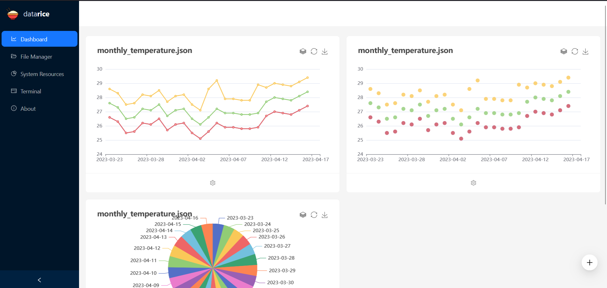

# datarice
datarice is a simple, and easy to install tool for data visualisation.

## Installation
The base project requires NodeJS v18, and it is set up like any other NodeJS projects.

```bash
git clone git@github.com:gohanko/datarice.git
cd datarice
npm ci
```

Then you need to build it using this command. Building the application takes a few minutes, but only need to be done once. 

```bash
npm run build
```

> Note: You also should rebuild it every time you update it.

The application is now installed, and all you need to do next is to run this command to start it.

```bash
npm run start
```

The URL to access it will be at [http://localhost:3000/](http://localhost:3000/)

## Configuration
The ```.env```, ```.env.development```, and ```.env.production``` files are all configuration files setting some default environment variables. For more information please have a look at this [documentation](https://nextjs.org/docs/pages/building-your-application/configuring/environment-variables#default-environment-variables).

The environment variables for this project are

- ```NODE_ENV``` - Sets the build mode of the project. Available values are ```development``` and ```production```. This affects how the project is built.
- ```DATA_STORE_DIRECTORY``` - Sets the directory on which the application is looking at. Usually point this to the folder where you have data files that you want to visualise.

To override the defaults, you should add a ```.env.local``` file in the root of this project, and set your variables there.

## Screenshots


## Contributing
Pull Requests are welcomed. For major changes, please open an issue first to discuss what you would like to change.

Please make sure to update or create tests as appropriate.

## Acknowledgment
I would like to thank the following people, whose guidance and help provided me with invaluable insights and inspirations while developing this project.

- [Dr. Ooi Boon Yaik](https://github.com/boonyaik) <<ooiby@utar.edu.my>>, my final year project supervisor, for the original project title/idea, and guiding me throughout my final year project. His valuable, and constructive suggestions and critiques has been extremely valuable to ensuring the project is successful.
- [Aaron Imming](https://github.com/aaimio) <<aaim@protonmail.com>>, for his help answering my NodeJS/React related question when I was developing the project. His advice, and help has allowed me to complete my work faster, and produce better code.

I would also like to thank my university, [University Tunku Abdul Rahman (UTAR)](https://www.utar.edu.my/), without which I would not have the opportunity to participate in academic research and development work.
